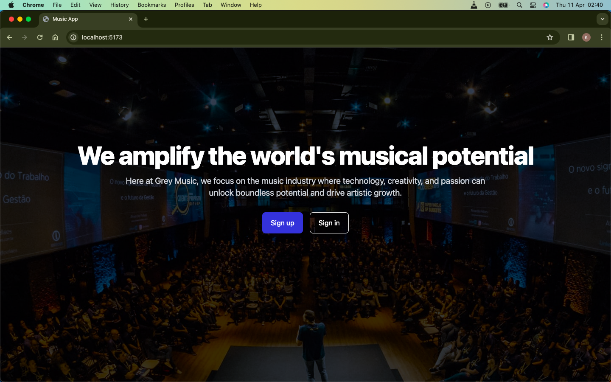
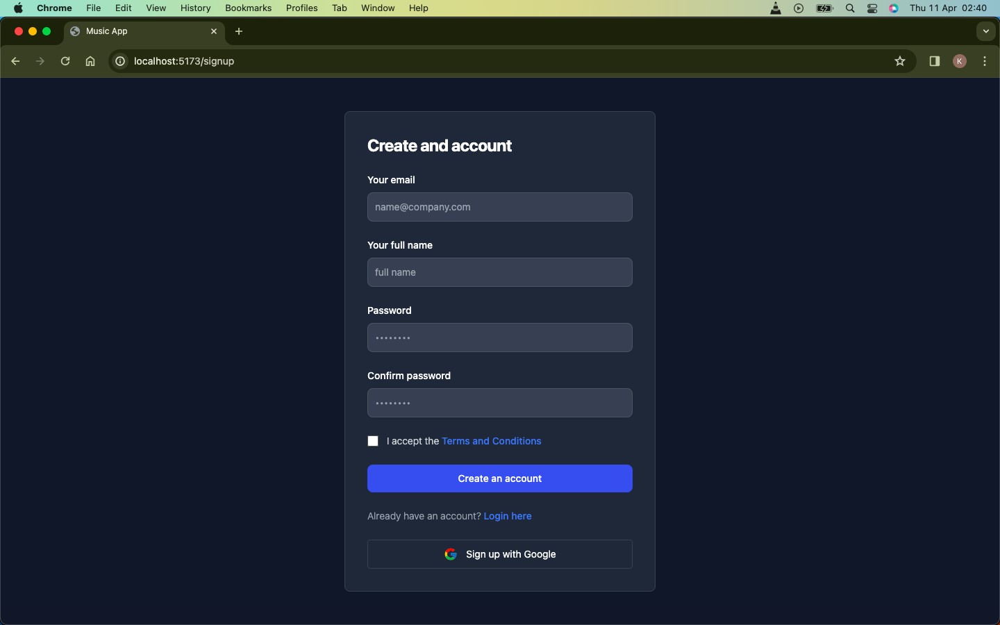
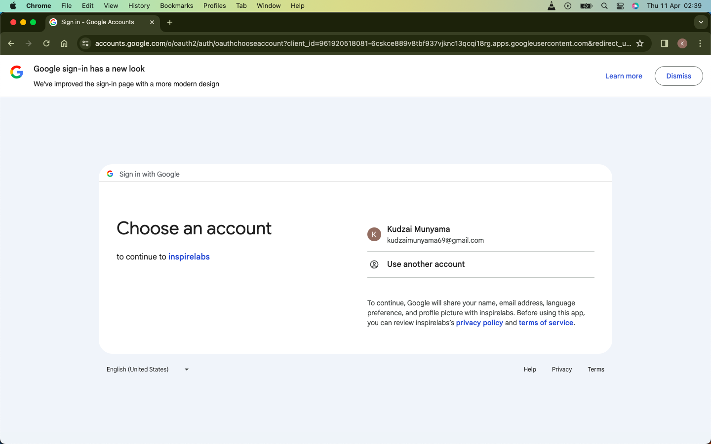
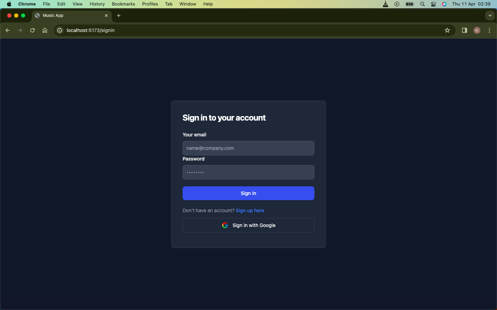
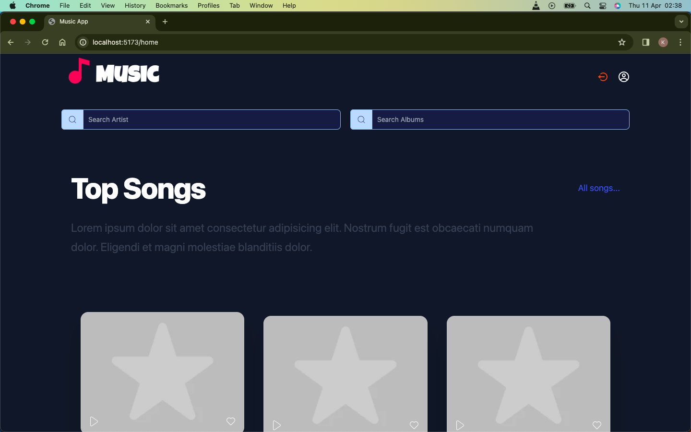
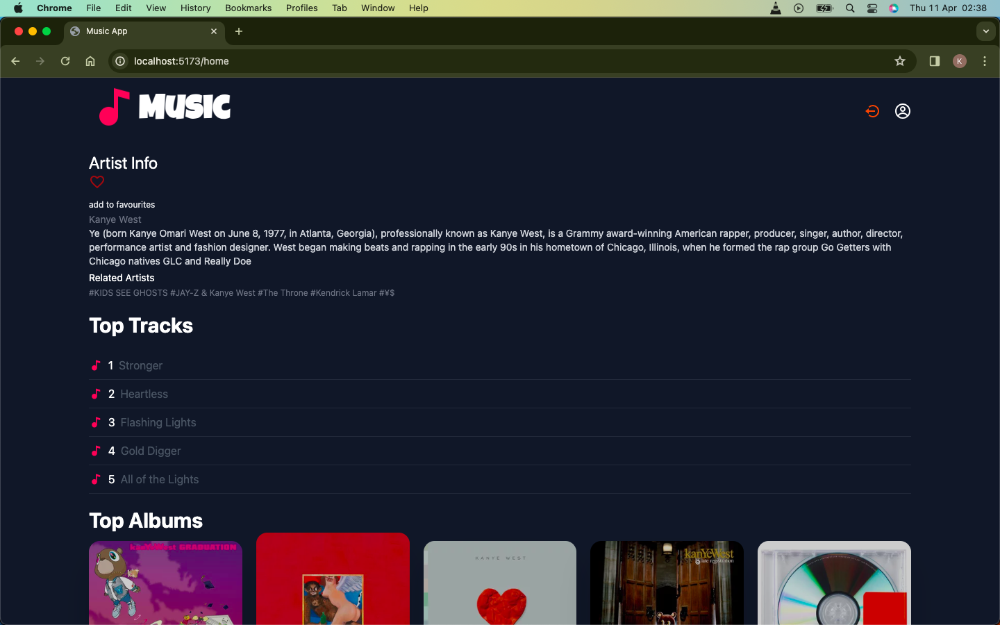
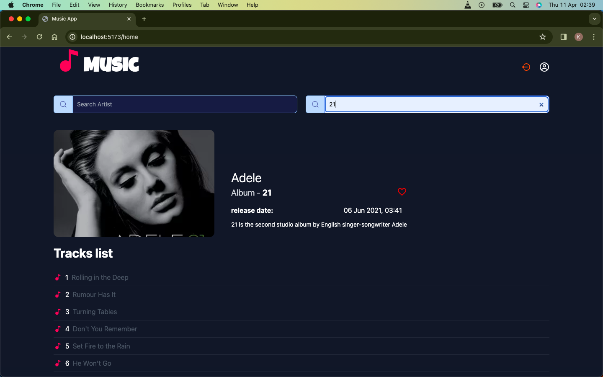
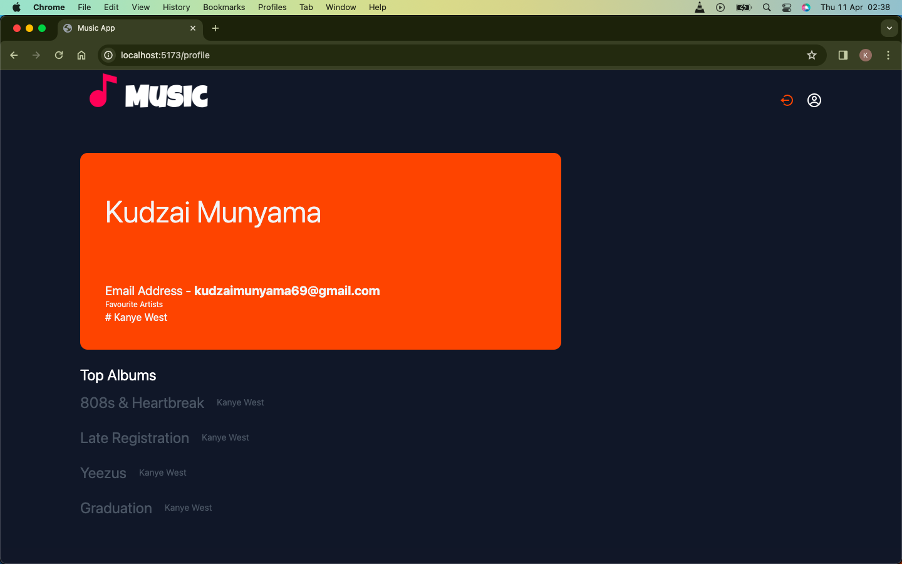

# Music Search and Discovery Web Application
This is a web application that allows users to search and view information about music artists and their albums. Users can sign up, log in with their Google account, and perform various functionalities related to artist and album search, as well as saving favorite artists and albums to their profile.

## Features
* User authentication with Google account
* Artist search: search for artists by name and view their basic information, top tracks, albums, and related artists
* Album search: search for albums by name and view their basic information, including the artist, release date, and track list
* Favorite artists and albums: logged-in users can save their favorite artists and albums to their profile and manage them (add, edit, delete)
* Intuitive and user-friendly interface
* Frontend built with ReactJS (or VueJS)
* Integration with Last.fm API for artist and album data
* Dockerized project for easy deployment

## Technologies Used
* Laravel (v10)
* PHP (v8)
* ReactJS (or VueJS)
* Last.fm API
* Google Sign-in API
* Docker


# Getting Started
### To run the project locally, follow these steps:

### Prerequisites

- Docker and Docker Compose should be installed on your machine. You can download them from [https://www.docker.com](https://www.docker.com).

### Download

To download the project, you have two options:

#### Option 1: Clone the Repository

1. Open your terminal or command prompt.
2. Change the current working directory to the location where you want to download the project.
3. Run the following command:

Clone the repository:
```
$ git clone https://github.com/kculz/InspireLabs-Assessment.git
```

#### Option 2: Download ZIP
1. Go to the project repository on GitHub: [https://github.com/kculz/InspireLabs-Assessment](https://github.com/kculz/InspireLabs-Assessment)
2. Change the current working directory to the project's root directory.
3. Run the following command to start the project using Docker Compose:
```
docker-compose up
```

# NB | NOTE
### App is not working when running docker
- To get Started use the following Method after cloning the project or downloading.

## Run frontend app (React App)

1. Open Terminal or Command prompt.
2. Change current directory to `app`.
```
$ cd app
```
3. Install frontend dependences by running the following command
```
$ npm install
```
4. Run the following command to run frontend.
```
$ npm run dev
```

## Run backend app (Laravel api)

1. Open Terminal or Command prompt.
2. Change current directory to `api`.
```
$ cd api
```
3. Install backend dependences by running the following command
```
$ composer install
```
-  #### Config DB and ENV
    - Copy contents of `.emv.example`
    - Change the `DB` env variable to you desired config settings

4. Run the following command to migrate db
```
$ php artisan migrate
```
5. Run the following command to start server
```
$ php artisan serve
```


- This command will start all the services defined in the docker-compose.yml file.
4. Once the containers are up and running, open your web browser and visit [http://localhost:5173](http://localhost:5173) to see the project running.

### Stopping the project
- To stop the project and terminate the running containers, press `Ctrl + C` in the terminal where Docker Compose is running.

# Screenshots









### Additional Notes
The project uses either MySQL as the database. Make sure to configure the `.env ` file accordingly.<br>
To Add Artists / Album to Favourites click on the Heart Icons.<br>
If Artist already exists in Favourites it will remove the it from the Favourites.<br>
#### NB - To search you press enter and on keydown the search results will be rendered.
